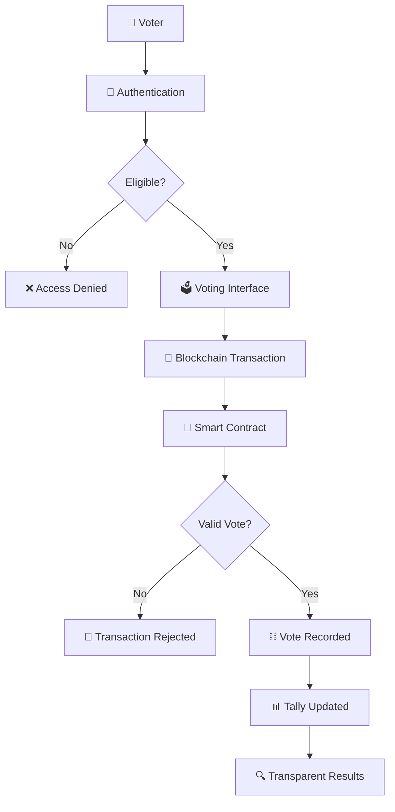

<div align="center">

<!-- HERO BANNER -->


<br />


<br />
<br />

<h1>🗳️ VOTECHAIN</h1>

<h3>Decentralized • Transparent • Secure</h3>

<p>
A next-generation blockchain-based voting ecosystem designed to bring
<strong>transparency, integrity, and verifiability</strong> to digital elections.
</p>

<br />

<a href="#-overview">Overview</a> •
<a href="#-features">Features</a> •
<a href="#-demo">Demo</a> •
<a href="#-architecture">Architecture</a> •
<a href="#-tech-stack">Tech Stack</a> •
<a href="#-getting-started">Setup</a>

<br />
<br />


</div>

---

# 🌌 The Future of Voting is Verifiable

Traditional voting systems often rely on centralized infrastructure, creating challenges related to transparency, data integrity, and auditability.

**VoteChain** explores how blockchain technology can provide a more transparent and tamper-resistant digital voting experience.

```text
┌──────────────────────────────────────────────────────────────┐
│                                                              │
│              👤 VOTER                                         │
│                │                                             │
│                ▼                                             │
│        🔐 IDENTITY VERIFICATION                              │
│                │                                             │
│                ▼                                             │
│         🗳️ CAST YOUR VOTE                                    │
│                │                                             │
│                ▼                                             │
│          📜 SMART CONTRACT                                   │
│                │                                             │
│                ▼                                             │
│           ⛓️ BLOCKCHAIN                                      │
│                │                                             │
│                ▼                                             │
│          📊 VERIFIED RESULTS                                 │
│                                                              │
└──────────────────────────────────────────────────────────────┘
```

> **VoteChain transforms voting from a system you simply trust into a process that can be independently verified.**

---

# 🎯 Overview

VoteChain is a blockchain-powered voting platform that uses **smart contracts and decentralized ledger technology** to create a transparent and tamper-resistant election environment.

The system is designed around three core principles:

<div align="center">

<table>
<tr>
<td align="center" width="33%">

## 🔐

### SECURITY

Protect election records using cryptographic and blockchain-based mechanisms.

</td>

<td align="center" width="33%">

## 🌐

### TRANSPARENCY

Make election activity independently auditable and verifiable.

</td>

<td align="center" width="33%">

## ⚡

### INTEGRITY

Prevent unauthorized modification and duplicate voting attempts.

</td>
</tr>
</table>

</div>

---

# ✨ Features

<table>
<tr>
<td width="50%">

### 🛡️ Tamper-Resistant Records

Votes are recorded through blockchain transactions, making unauthorized modification extremely difficult.

</td>
<td width="50%">

### 🆔 Voter Eligibility

Only eligible voters should be allowed to participate in a configured election.

</td>
</tr>

<tr>
<td width="50%">

### 🗳️ One Vote Per Voter

Smart contract logic can enforce one-vote-per-election rules.

</td>
<td width="50%">

### 🔍 Transparent Auditing

Election activity can be verified using blockchain transaction records.

</td>
</tr>

<tr>
<td width="50%">

### 📊 Live Results

Election results can be displayed through a real-time dashboard.

</td>
<td width="50%">

### 🌐 Decentralized Infrastructure

The architecture reduces dependence on a single centralized database.

</td>
</tr>
</table>

---

# 🎥 Demo

<div align="center">

### 🚀 Watch VoteChain in Action

<!-- Replace this GIF URL with your own project demo GIF -->


<br />

<em>🗳️ Voter authentication → Vote casting → Smart contract validation → Blockchain recording → Result visualization</em>

</div>

> 💡 **Tip:** Record your actual project using OBS Studio, Screen Studio, or Loom and export it as `demo.gif`. Then place it inside your repository and update the image path:

```markdown

```

---

# 🖥️ Project Screenshots

<div align="center">

### 🏠 Voting Dashboard


<br />
<br />

### 🗳️ Voting Interface


<br />
<br />

### 📊 Results Dashboard


</div>

> 📁 Add your screenshots inside the `assets/` folder.

Recommended structure:

```text
assets/
├── dashboard.png
├── voting-interface.png
├── results-dashboard.png
└── demo.gif
```

---

# 🏗️ Architecture



---

# 🔄 Voting Workflow

```text
┌──────────────┐
│ 👤 REGISTER  │
└──────┬───────┘
       ▼
┌──────────────┐
│ 🔐 VERIFY    │
└──────┬───────┘
       ▼
┌──────────────┐
│ 🗳️ VOTE      │
└──────┬───────┘
       ▼
┌──────────────┐
│ 📜 VALIDATE  │
│ SMART CONTRACT│
└──────┬───────┘
       ▼
┌──────────────┐
│ ⛓️ RECORD    │
│ BLOCKCHAIN   │
└──────┬───────┘
       ▼
┌──────────────┐
│ 📊 TALLY     │
│ RESULTS      │
└──────────────┘
```

---

# 🧰 Tech Stack

<div align="center">

<table>
<tr>
<td align="center" width="25%">

### ⛓️ Blockchain


<br />

Solidity  
Ethereum  
Polygon

</td>

<td align="center" width="25%">

### ⚙️ Backend


<br />

Python  
FastAPI  
Web3 APIs

</td>

<td align="center" width="25%">

### 🎨 Frontend


<br />

React  
HTML  
CSS  
JavaScript

</td>

<td align="center" width="25%">

### 🛠️ Tools


<br />

Git  
GitHub  
VS Code

</td>
</tr>
</table>

</div>

---

# 📁 Project Structure

```text
block-chain-based-voting-system/
│
├── 📁 frontend/
│   ├── 📁 components/
│   ├── 📁 pages/
│   ├── 📁 assets/
│   └── App.jsx
│
├── 📁 backend/
│   ├── main.py
│   ├── routes/
│   └── services/
│
├── 📁 contracts/
│   └── Voting.sol
│
├── 📁 scripts/
│   └── deploy.js
│
├── 📁 test/
│   └── voting.test.js
│
├── 📄 package.json
├── 📄 requirements.txt
└── 📄 README.md
```

---

# 🚀 Getting Started

## 1️⃣ Clone the Repository

```bash
git clone https://github.com/your-username/block-chain-based-voting-system.git
cd block-chain-based-voting-system
```

## 2️⃣ Install Dependencies

```bash
npm install
```

For the backend:

```bash
pip install -r requirements.txt
```

## 3️⃣ Configure Environment Variables

Create a `.env` file:

```env
BLOCKCHAIN_NETWORK=polygon-mumbai
RPC_URL=your_rpc_url
CONTRACT_ADDRESS=your_contract_address
PRIVATE_KEY=your_private_key
```

⚠️ **Never upload private keys or secret credentials to GitHub.**

## 4️⃣ Start the Application

```bash
npm run dev
```

---

# 🔐 Security Principles

VoteChain follows a security-first design philosophy:

| Principle | Description |
|---|---|
| 🔒 Integrity | Blockchain records are tamper-resistant |
| 🆔 Eligibility | Only authorized voters should participate |
| 🚫 Duplicate Prevention | One vote per voter per election |
| 🔍 Auditability | Transactions can be independently verified |
| 🔑 Key Protection | Sensitive credentials must remain private |
| 📜 Contract Validation | Voting rules are enforced through smart contracts |

---

# 🗺️ Roadmap

### ✅ Phase 1 — Core Platform

- [x] Basic voting interface
- [x] Candidate management
- [x] Smart contract foundation
- [x] Blockchain integration

### 🚧 Phase 2 — Security & Experience

- [ ] Advanced voter verification
- [ ] Improved privacy mechanisms
- [ ] Real-time analytics dashboard
- [ ] Mobile responsive interface

### 🔮 Phase 3 — Advanced Web3

- [ ] Zero-Knowledge Proof integration
- [ ] DAO-based election management
- [ ] Multi-chain deployment
- [ ] Decentralized identity integration
- [ ] Independent smart contract audit

---

# 📈 Future Vision

VoteChain is not just about putting votes on a blockchain.

The long-term vision is to build a complete decentralized election infrastructure where:

```text
IDENTITY
   ↓
PRIVACY
   ↓
VERIFICATION
   ↓
VOTING
   ↓
CONSENSUS
   ↓
AUDITABILITY
```

> 🌍 **A future where election integrity is supported by mathematics, cryptography, and transparent technology.**

---

# 🤝 Contributing

Contributions are welcome!

```bash
# Fork the repository

# Create a feature branch
git checkout -b feature/your-feature

# Commit your changes
git commit -m "Add your feature"

# Push your branch
git push origin feature/your-feature
```

Then open a Pull Request 🚀

---

# 📜 License

This project is licensed under the **MIT License**.

---

<div align="center">


<h2>🗳️ VOTECHAIN</h2>

<p>
<strong>Decentralizing trust. Securing votes. Building the future.</strong>
</p>

<br />

⭐ <strong>Star this repository if you believe technology can make systems more transparent.</strong>

<br />
<br />


</div>
